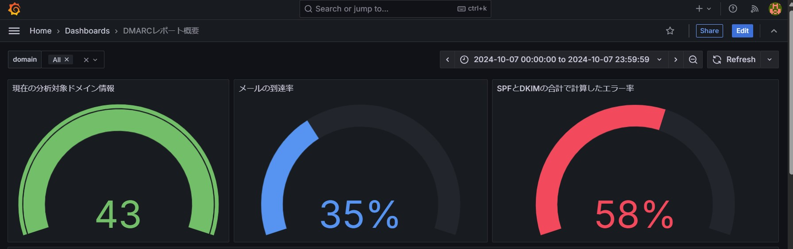
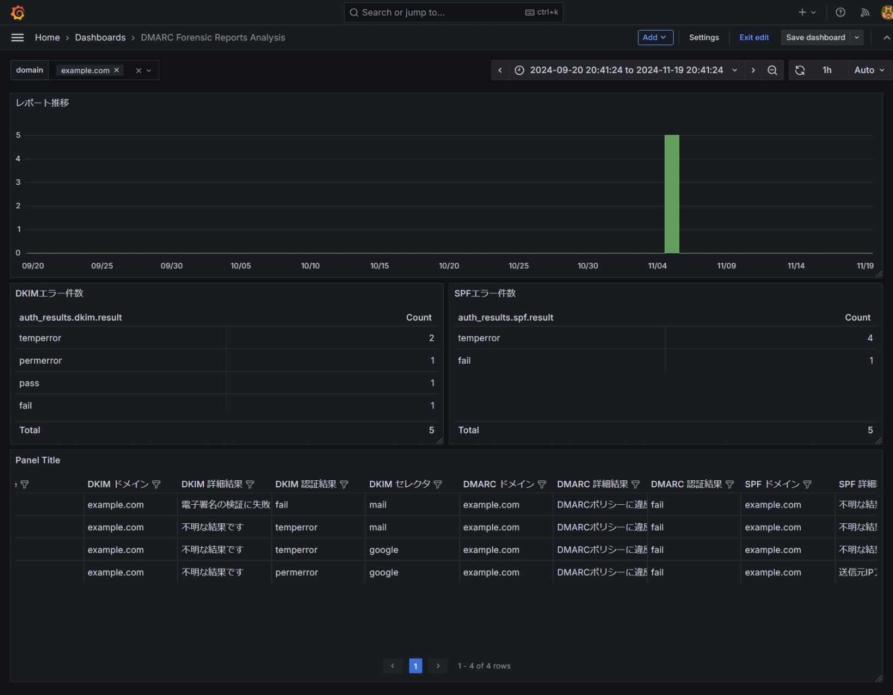

# DMARCレポート解析ツール


## 概要

  このツールは、メールサーバーから受信したDMARCレポートを解析し、視覚化するシステムです。XML形式のファイルまたは、ZIPまたはGZIP形式で圧縮されたXMLレポートを処理し、Elasticsearchに保存、Grafanaを使用してダッシュボード形式で表示します。

主な機能：

  - DMARCレポート（ZIP/GZIP/XML）の自動解析
  - ネストされたZIPファイルの処理対応
  - SPF/DKIM認証結果の分析
  - 組織別のメール統計情報
  - 時系列での認証状況の可視化
  - ファイルの重複読み込みが無いように対策しました。
  - filesの中身が変わったか監視しているので、DMARCのレポートの入れ替えの際に、dockerのビルドを行わなくても良いです。
    (Docker Compose の watch 機能を使う)


## システム要件

  - Docker
  - Docker Compose
  - 約2GB以上の空きディスク容量


## インストール方法

1. リポジトリのクローン：
```bash
git clone [リポジトリURL]
cd DMARC_Analyzer
```

2. 必要なディレクトリの作成：
```bash
mkdir -p files
```

3. システムの起動：
```bash
docker-compose build
docker-compose up -d
```

```bash
docker-compose up --build
```
は、せっかく作ったGrafanaのパネルのデータが消えてしまうリスクがあると思います。
```bash
docker-compose up -d
```
で、コンテナを起動してください。


# Watchモードでコンテナを起動
docker-compose up --watch

filesのフォルダの中身が変わったことを監視するときは、このWatchモードでコンテナを起動してください。

## 使用方法

filesのフォルダsの中に、DMARCのレポートをZipまたはGz形式の圧縮ファイルのままセットしてください。

### コマンドラインインターフェース
2024年11月4日現在動作確認していないので、実装されていますが保証できません。
理由は、ドメインの環境変数の扱いをGrafanaの環境変数を使う方式に変更しているため。

DMARCレポートの解析は、以下のコマンドラインオプションを使用して実行できます：

1. 特定のドメインのレポート解析：
```bash
python src/dmarc_analyzer_cli.py --domain example.com
```

2 カスタムディレクトリの指定：
```bash
python src/dmarc_analyzer_cli.py --domain example.com \
  --report-dir /custom/reports \
  --extract-dir /custom/extracted
```

3.XMLファイルの直接処理:
```bash
python dmarc_analyzer_cli.py --xml-file /path/to/dmarc_report.xml
```

4.ドメインとXMLファイルの両方を指定:
```bash
python dmarc_analyzer_cli.py --domain example.com --xml-file /path/to/dmarc_report.xml
```


### 異なるドメインのデータを分析する場合

以下の手順で、異なるドメインのデータを個別に分析できます：

1. 既存のコンテナを停止：
```bash
docker-compose down
```

2. レポートディレクトリの準備：
```bash
# PowerShellの場合
Remove-Item .\reports\* -Force

# Linuxの場合
rm -rf ./reports/*
```

3. 新しいドメインのレポートを配置：
注意：DMARCレポートファイルは必ず `files` ディレクトリに配置してください。これは、Dockerコンテナがこのディレクトリをマウントして処理を行うように設定されているためです。


4. 解析の実行：
```bash
# PowerShellの場合
.\reset-analysis.ps1 --domain new-example.com

# Linuxの場合
./reset-analysis.sh --domain new-example.com
```

### Elasticsearchのデータ構造

データは以下の形式でElasticsearchに保存されます：

1. aggregate_reports-YYYY.MM インデックス：
エラーの概要解析

2. dmarc_stats-YYYY.MM インデックス：
個別のエラーの詳細解析


### 統計情報の確認

各ドメインの統計情報は以下のように確認できます：

1. 認証成功率：
- DKIM/SPF認証の成功率
- 時系列での推移
- 送信元IPごとの分析

2. メール統計：
- 総メール数
- 認証方式ごとの成功/失敗数
- エラーの種類と頻度


## Grafanaダッシュボードの管理

Grafanaダッシュボードへのアクセス

ブラウザで以下のURLにアクセス：

http://localhost:3000

初期ログイン情報：

ユーザー名: admin

パスワード: admin

ダッシュボードの表示：

左メニュー → Dashboards → DMARCレポート概要


### ダッシュボード構成

#### ディフォルトのダッシュボード

aggregate_reportのレポート解析
dmarc_summary_dashboard.json



フォレンジックレポートの解析用
DMARC Forensic_reports Analysis.json



上記は、実装予定も含みます。


### ダッシュボードの更新手順

#### UIで変更したダッシュボードをエクスポートする手順
1. ダッシュボードの設定から「Export」を選択
2. 「Export for sharing externally」を選択
3. JSONファイルとして保存
4. 保存したJSONファイルを`./dashboards`ディレクトリに配置


1. エクスポート：
```
1. Grafana UIで対象のダッシュボードを開く
2. 設定（⚙）アイコン → Share dashboard → Export
3. 'Export for sharing externally' を選択
4. 'Save to file' をクリック
```

2. 保存：
  - エクスポートしたJSONファイルを `grafana/dashboards/` ディレクトリに保存
  - ファイル名規則に従って保存（例：dmarc_summary_dashboard.json）

3. バージョン管理：
  - 変更内容をコミット
  - 変更履歴を記録（どのような更新を行ったか）

##### ダッシュボードの名前を変える

 "title": "DMARCレポート概要"が、ダッシュボードのタイトルです。
```json
  },
  "time": {
    "from": "now-30d",
    "to": "now"
  },
  "timepicker": {},
  "timezone": "",
  "title": "DMARCレポート概要",
  "uid": "ce2vsl7rxxjwga",
  "version": 8,
  "weekStart": ""
}
```


### ダッシュボードの説明

#### 概要ダッシュボード（dmarc_summary_dashboard.json）


### 注意事項
  - ダッシュボードの更新時は必ずバックアップを作成
  - 重要な変更は事前にテスト環境で確認
  - パネルの配置や設定を変更した場合は、その内容をREADMEに反映


### トラブルシューティング
1. ダッシュボードが表示されない場合：
```bash

# Grafanaコンテナの再起動
docker-compose restart grafana
```

2. データが更新されない場合：
```bash

# DMARCアナライザーの再実行
./reset-analysis.ps1
```


### 運用手順：
#### ダッシュボードの更新時：
1. Grafana UIでダッシュボードを編集
2. Share dashboard → Export → Save to file
3. ダウンロードしたJSONを grafana/dashboards/ に保存

#### システムの再構築時：
完全なリセットと再構築
.\reset-analysis.ps1

#### 新しい環境へのデプロイ時：

##### 必要なファイルをコピー
grafana/
docker-compose.yaml
Dockerfile
src/


### Grafanaダッシュボードの管理

1. ダッシュボードのエクスポート：
  - Grafana UIで Share dashboard → Export
  - JSONファイルを `grafana/dashboards/` に保存

2. ダッシュボードの更新：
  - JSONファイルを編集または置き換え
  - システムを再起動: `docker-compose restart grafana`

3. 新しいダッシュボードの追加：
  - JSONファイルを `grafana/dashboards/` に配置
  - `grafana/provisioning/dashboards/dashboards.yaml` を必要に応じて更新


## 設定のカスタマイズ


### Docker設定の変更
`docker-compose.yaml`ファイルで以下の設定が可能：
  - ポート番号の変更
  - ボリュームのマウントポイント
  - 環境変数の設定


### Grafanaダッシュボードのカスタマイズ
1. 新しいパネルの追加：
  - 「Add panel」→ 「Add new panel」
  - 適切なビジュアライゼーションの選択
  - SQLクエリの設定

2. 既存パネルの編集：
  - パネルのタイトルをクリック
  - 「Edit」を選択


## 注意事項
  - システムを停止する場合は `docker-compose down` を使用
  - データベースのバックアップは定期的に実施することを推奨
  - Grafanaの初期パスワードは必ず変更してください

## 補足
2024年11月3日現在forensic_reports-*のインデックスを生成するためのフォレンジックレポートのXMLのフォーマットの実際のデータが無いので、
データソースのElasticsearchのForensic Reportsは、接続テストが行われていません。
データソースのElasticsearchのForensic Reportsは、Grafanaのデータソースに、登録されています。


## ライセンス
このプロジェクトはMITライセンスの下で公開されています：

```
MIT License

Copyright (c) 2024 [あなたの名前 または プロジェクト名]

以下に定める条件に従い、本ソフトウェアおよび関連文書のファイル（以下「ソフトウェア」）の複製を取得するすべての人に対し、
ソフトウェアを無制限に扱うことを無償で許可します。これには、ソフトウェアの複製を使用、複写、変更、結合、掲載、頒布、
サブライセンス、および/または販売する権利、およびソフトウェアを提供する相手に同じことを許可する権利も無制限に含まれます。

上記の著作権表示および本許諾表示を、ソフトウェアのすべての複製または重要な部分に記載するものとします。

ソフトウェアは「現状のまま」で、明示であるか暗黙であるかを問わず、何らの保証もなく提供されます。
ここでいう保証とは、商品性、特定の目的への適合性、および権利非侵害についての保証も含みますが、それに限定されるものではありません。
作者または著作権者は、契約行為、不法行為、またはそれ以外であろうと、ソフトウェアに起因または関連し、
あるいはソフトウェアの使用またはその他の扱いによって生じる一切の請求、損害、その他の義務について
何らの責任も負わないものとします。
```


## サポートと免責事項


### サポート
  - GitHub Issuesを通じて問い合わせを受け付けています
  - 可能な範囲で回答やサポートを提供しますが、即時の対応や継続的なサポートを保証するものではありません
  - プルリクエストや機能改善の提案も歓迎します


### 免責事項
1. 本ソフトウェアは「現状のまま」提供され、明示または黙示を問わず、いかなる種類の保証も伴いません
2. 作者は以下について一切の責任を負いません：
  - ソフトウェアの使用により生じたいかなる損害
  - データの損失や業務の中断
  - その他の商業的な損害や損失
3. 本ソフトウェアを使用する場合、すべてのリスクはユーザーが負うものとします
4. DMARCレポートの解析結果の正確性について、完全性を保証するものではありません
5. 重要なシステムやセキュリティに関わる判断を行う場合は、必ず他の手段での確認も併せて行ってください


### 推奨事項
  - 本番環境で使用する前に、テスト環境での十分な検証を行ってください
  - 定期的なデータのバックアップを推奨します
  - セキュリティに関する重要な判断は、複数の情報源と手段を用いて行ってください
